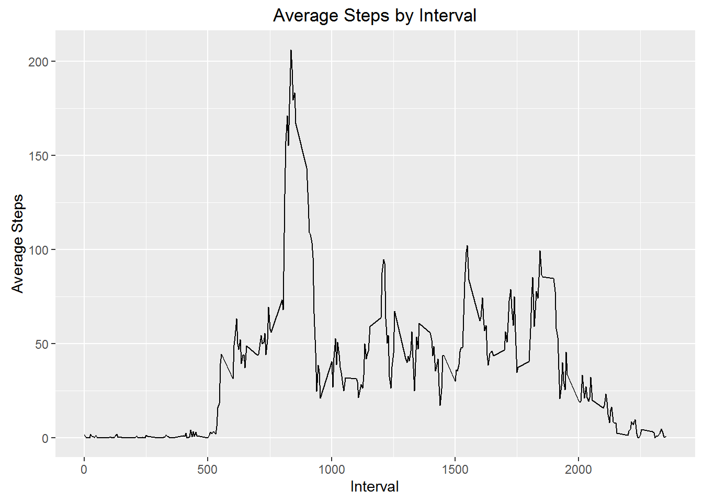

Introduction
-------------------------------

This document will walk the reader through the load, cleanup, and analysis of a dataset collected from a personal activity monitoring device. The device collects data at five-minute intervals throughout the day, and this comma-separated dataset contains two months of data from a single individual, collected between October and November 2012.

There are 17,568 observations of the following three variables:
  - **steps:** total number of steps taken in a five-minute interval (missing values coded as "NA")
  - **date:** the date on which the measurement was collected, YYYY-MM-DD format
  - **interval:** identifier for the five-minute interval in which the measurement was collected.


Reading in the Data
-------------------------------

For ease of work and efficiency, we'll use ```data.table``` and ```read.csv``` to load the dataset into RStudio and set it as a data table. **Note:** This document assumes you have already downloaded activity.csv and saved it to your working directory.


```r
library(data.table)
activityDT <- data.table(read.csv("./activity.csv"))
```


What are the average total steps taken in a day?
---

To get an overview of the data, we'll create a simple histogram of steps taken per day. We'll do some data tidying along the way, creating a table of total steps per day and assigning readable column headers. Then, we plot the data.


```r
  steps.per.day <- activityDT[,sum(steps), by=date]
  names(steps.per.day) <- c("date", "total.steps")
  
  hist(steps.per.day$total.steps,
          main = "Histogram of Total Steps per Day",
          xlab = "Total Steps",
          ylab = "Frequency",
          border = "white",
          col = "black"
       )
```


Then, we'll report the mean and median of the total number of steps taken per day with the following code. Adding ```na.rm=T``` allows us to ignore missing values:


```r
mean.total.steps   <- mean(steps.per.day$total.steps, na.rm = T)
median.total.steps <- median(steps.per.day$total.steps, na.rm = T)

mean.total.steps
```

```
## [1] 10766.19
```

```r
median.total.steps
```

```
## [1] 10765
```

If we round to the nearest whole number, the mean of the dataset is 10,766 steps, and the median is 10,765. Pretty close!

What does the average daily activity pattern look like?
------

Let's use a time series plot to see a high-level overview of what this person's daily activity looks like as the day progresses. First, we'll calculate the average number of steps taken per five-minute interval and give it some readable headers.


```r
  mean.int.steps <- activityDT[ , mean(steps, na.rm=T), by=interval]
  names(mean.int.steps) <- c("interval", "mean.steps")
```

Then, we'll load up the useful package and plot the data.


```r
library(useful)
  
  qplot(interval, mean.steps, data=mean.int.steps, geom="line",
        main="Average Steps by Interval", xlab="Interval", ylab="Average Steps")
```



Then, we'll find the interval with the most average daily steps.


```r
most.avg.steps <- max(mean.int.steps$mean.steps)
highest.interval <- mean.int.steps[mean.steps==most.avg.steps, interval]

highest.interval
```

```
## [1] 835
```

So, interval #835 has the highest daily average step count.

What about missing values?
---

Earlier, we ignored missing values when we calculated means and medians. In order to get a better sense of the data, let's find out how many null rows there are and how we might best approach the problem.

First, let's find how many nulls out of ~17,000 observations:

```r
  sum(is.na(activityDT))
```

```
## [1] 2304
```

Our raw dataset contains 2,304 missing values. Let's replace these nulls with the average step count for that interval.

We'll create a new dataset and replace the NAs with the average step count for the corresponding interval.


```r
  data.full <- activityDT
  nas <- is.na(data.full$steps)
  avg_interval <- tapply(data.full$steps, data.full$interval, mean, na.rm=T, simplify=T)
  data.full$steps[nas] <- avg_interval[as.character(data.full$interval[nas])]
```

Let's make sure that worked - we should get 0 missing values.

```r
    sum(is.na(data.full))
```

```
## [1] 0
```

Got 'em.

Now that we have our missing values filled in with estimated data, let's redo the earlier histogram with the new dataset.


```r
    steps.per.day.full <- data.full[,sum(steps), by=date]
  names(steps.per.day.full) <- c("date", "total.steps")
  
  hist(steps.per.day.full$total.steps,
       main = "Histogram of Total Steps per Day, with Imputed Values",
       xlab = "Total Steps",
       ylab = "Frequency",
       border = "white",
       col = "black"
      )
```


Now, we'll recalculate the mean and median.


```r
  mean.total.steps.full <- mean(steps.per.day.full$total.steps)
  median.total.steps.full <- median(steps.per.day.full$total.steps)
  
  mean.total.steps.full
```

```
## [1] 10766.19
```

```r
  median.total.steps.full
```

```
## [1] 10766.19
```

By adding the estimated step counts, the mean and median of the full dataset are now equal at about 10,766 steps each.

Differences in Activity Between Weekends and Weekdays
---

I don't know about you, but my step count is drastically different on Sunday morning than on Tuesday morning. Let's investigate the differences between weekdays vs. weekends by creating and comparing visualizations of weekday activity vs. weekend activity.

We'll first add the day of the week and "day type" to our full dataset.


```r
data.full$date <- as.Date(data.full$date)
  
data.full$day.of.week <- weekdays(data.full$date)
data.full$day.type    <- as.factor(ifelse(data.full$day.of.week=="Saturday"|
                                          data.full$day.of.week=="Sunday", "weekend",
                                          "weekday"))
```

And finally, we'll create the plot.


```r
  library(lattice)
  
  plotdata <- aggregate(steps ~ interval + day.type, data.full, mean)
  xyplot(steps ~ interval | factor(day.type), data=plotdata, aspect=1/3, type="l")
```


These plots give us a pretty good sense of the differences between weekend and weekday activity. We can see that in weekdays, earlier intervals have a much higher step count than the same intervals on the weekends. This isn't surprising - most likely, the big increase is from the commute to work.


